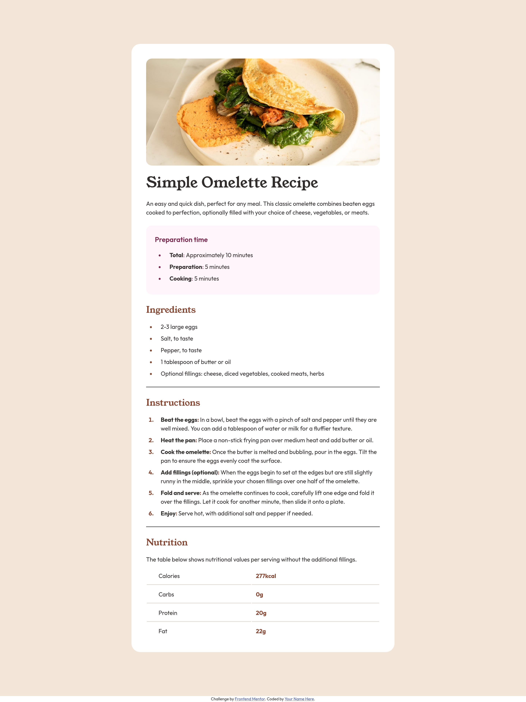

# Frontend Mentor - Recipe page solution

This is a solution to the [Recipe page challenge on Frontend Mentor](https://www.frontendmentor.io/challenges/recipe-page-KiTsR8QQKm). Frontend Mentor challenges help you improve your coding skills by building realistic projects.

  

## Table of contents

  

- [Overview](#overview)

- [The challenge](#the-challenge)

- [Screenshot](#screenshot)

- [Links](#links)

- [My process](#my-process)

- [Built with](#built-with)

- [What I learned](#what-i-learned)

- [Continued development](#continued-development)

- [Useful resources](#useful-resources)

- [Author](#author)

  

**Note: Delete this note and update the table of contents based on what sections you keep.**

  

## Overview

  

### Screenshot

  

  

### Links

  

- Live Site URL: [https://burnlees.github.io/recipe-page/](https://burnlees.github.io/recipe-page/)

  

## My process

  

### Built with

  

- Semantic HTML5 markup

- CSS custom properties

- Flexbox

- Media queries

  
  

### What I learned

  

With the previous challenges being somewhat simpler, and lack of experience, I hadn't really encountered a need to try and think about the responsiveness of my layouts before. So I learned how to use media queries as well as styling of elements I haven't had to deal with as of yet, including hr, tables and more in-depth list styling.

  

### Continued development

  

Going forward I want to improve my knowledge on how best to build a layout that will translate onto mobile and smaller screen sizes more effectively.

  
  
  

### Useful resources

  

- [A practical guide to responsive web design](https://youtu.be/x4u1yp3Msao?si=AoFX6iRYvxKGc9Hq) this helped ascertain better knowledge on how to implement responiveness, however only looked into this after running into problems when I thought I was finished and finally checked mobile screen size.

  
  

## Author

  

- Frontend Mentor - [@burnlees](https://www.frontendmentor.io/profile/burnlees)